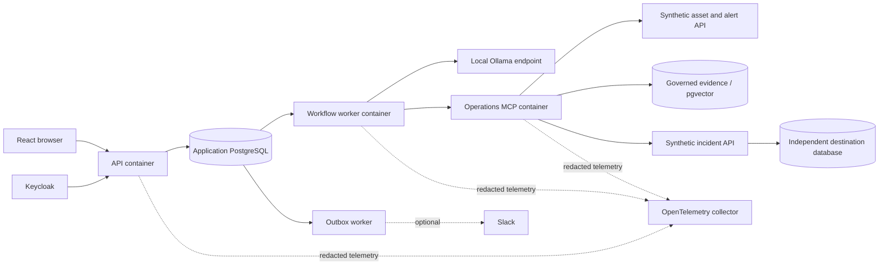

# Operations Copilot — authoritative AI build specification

**Document:** OPS-BUILD-1.0  
**Prepared:** 2026-10-06  
**Audience:** A coding AI working with the repository owner. No prior chat is required.  
**Purpose:** Implement and verify the target project by extending the included local reference.  
**Status:** BUILD CONTRACT, NOT A CLAIM OF COMPLETED IMPLEMENTATION.

> **Amended (OPS-BUILD-1.3.5, 2026-10-07):** [`SPEC_AMENDMENTS.md`](SPEC_AMENDMENTS.md) takes precedence over this document wherever they conflict. That includes the repository layout (ADR-0001), the v1 scope cut and one-replica profile (ADR-0002), the state machine, leases and locking, the execution and recovery protocol, authority boundaries, MCP and library facts, the model profile, evaluation, schema alignment, and `handoff/tasks.json`. AM-00 lists the superseded 1.0 passages explicitly. This file is otherwise unchanged from the delivered handoff.

## 0. Start here: authority, scope, and current evidence

Read `AGENTS.md`, this entire specification, `STATUS.md`, `handoff/tasks.json`, and `SESSION_STATE.md` before editing. Inspect the repository and run the reference tests before proposing a rewrite. Start at the earliest incomplete milestone whose dependencies are satisfied.

This document supersedes earlier conversational plans, generated infographic wording, and the archived implementation guide. It is the single authority for product behavior, architecture, sequencing, and acceptance. `schemas/` and `handoff/acceptance-matrix.json` are its machine-readable companions. If they disagree, record the discrepancy and reconcile against this specification before implementation. `docs/archive/`, `reports/historical/`, and the original ZIP in `provenance/` are historical evidence, not alternative instructions. The six stage charts are navigation aids, not proof of implementation or a strictly sequential runtime.

### What actually exists

The included source implements a **single-process, synthetic, local reference**: Python domain rules, SQLite application state, an independent SQLite incident/receipt store, a deterministic model substitute, a small FastAPI API, and a native HTML/JavaScript interface. Its **58 deterministic domain/API tests were rerun successfully during this handoff**. The reference recovery CLI deliberately loses a response after destination commit and reconciles one incident. See `reports/handoff/VERIFICATION.md` for the exact checks and limitations.

The reference is not the target production-oriented system. Its MCP and LangGraph integrations are examples, not the default execution path. An Ollama adapter exists but real inference has not been demonstrated here. PostgreSQL, real OIDC, React, LangChain integration, authenticated remote MCP, durable distributed workers, production telemetry, complete retrieval, actual container/cluster deployment, model evaluations, restoration, and upgrade experiments still require implementation and independent evidence. No cloud resource or remote repository was created by this handoff.

Preserve the original control invariants while replacing adapters. Do not silently present direct calls as MCP, SQLite as PostgreSQL, a fake model as a real LLM, a reconstructed Python object as a killed pod, or a manifest as a verified deployment. The reference pytest configuration excludes external-SDK integration tests; inspect it and create explicit required target suites rather than carrying that exclusion into a green target release.

### Corrections that must survive implementation

1. **LangGraph coordinates; LangChain supplies model/prompt components; MCP connects tools.** None is a substitute for application authorization.
2. **Retrieve evidence before the final evidence-backed model draft.** The chart labels are responsibilities, so runtime can follow stage 2 → stage 4 reads → stage 3 drafting → stage 5 review → stage 4 guarded write → stage 6 result.
3. A draft or a chat message saying “yes” is not an execution grant. Approval is an independent, authenticated, persisted decision bound to exact content.
4. A timeout can mean **OUTCOME_UNKNOWN**, not failure. Reconcile using the original action identity and the destination receipt.
5. A receipt lookup is a required operational capability. The target adds a restricted reconciliation-only MCP tool alongside the four business tools so recovery is actually implementable.
6. Model explanations are non-authoritative. Display evidence, assumptions, limitations, and actual execution events. Never fabricate an internal chain of thought or use emitted reasoning as an audit record.
7. Feedback produces reviewable evaluation candidates. It does not trigger automatic training, prompt edits, permission changes, or deployments.
8. “Production-oriented portfolio project” is not a safety certification, compliance certification, availability guarantee, or proof of universal exactly-once execution.

## 1. Product and success definition

Build an operational incident assistant using entirely synthetic information. A requester investigates a fictional asset and interval. The assistant obtains permitted asset status, recent alerts, and effective approved procedures; asks for missing information; produces a supported incident proposal or abstains; waits for a different authorized reviewer; and creates exactly the reviewed incident **at most once within the synthetic destination contract**.

Example request: “Investigate the alerts on Asset A17 over the last 24 hours and prepare an incident.” The response must not claim root cause unless the evidence establishes it. Equipment actuation is prohibited.

A successful task has the correct asset and fixed time interval, permitted and sufficiently current evidence, a supported draft, a valid independent approval where a write is requested, the intended destination state, and a truthful result projection. An unsupported task that correctly abstains can also succeed under its scenario-specific criteria. A fluent answer alone is not task success.

The portfolio must answer: What useful task was solved? Why this architecture instead of a chatbot? What was actually measured? How is authority enforced? What happens when a dependency fails? Can another person reproduce it?

## 2. Scope and decisions

### Required for portfolio version 1

One bounded investigation workflow; actual LangChain model integration inside an explicit LangGraph workflow; a custom authenticated MCP server and independent client tests; local Ollama plus a clearly labeled deterministic test substitute; governed lexical retrieval plus a measured pgvector comparison; PostgreSQL persistence and isolated tenant data; independent approval; idempotent synthetic incident writes and reconciliation; web chat with clarification, evidence, approvals and live activity; Docker/Compose; tested kind/Helm deployment; observability; real-model evaluation; secure CI; restore/upgrade evidence; documentation and repeatable demos.

### Optional after version 1

Opt-in Slack notifications/decisions reusing the same identity and control rules; an explicitly approved hosted-model adapter; Terraform/EKS after a cost and teardown plan. Voice, other business connectors, multiple agents, fine-tuning, vector rerankers, approximate search, separate brokers, and a service mesh are deferred until a measured need justifies them.

### Excluded

Real equipment control; employer data; arbitrary SQL, shell, or URL-fetch tools; automated privilege escalation; model-managed credentials; public anonymous write access; automatic cloud fallback; automatic online learning; multi-cloud support merely for a technology list.

### Fixed choices and reasoning

| Choice | Decision and reason | Trade-off / revisit condition |
|---|---|---|
| Backend | Python 3.13-compatible target, FastAPI, Pydantic; one shared domain package. | Check exact compatible versions. A typed shape does not establish semantic truth. |
| Orchestrator | Explicit LangGraph graph, durable PostgreSQL checkpoints. [S01–S02] | Additional state coordination is justified by pauses/recovery; no free-running agent loop in v1. |
| Model integration | LangChain prompt/message components and `langchain-ollama` ChatOllama. [S03] | Keep provider details behind a narrow adapter. Test schema behavior with the actual chosen model. |
| Tools | Official MCP Python SDK server/client over authenticated Streamable HTTP. [S04–S05] | Additional transport and identity contracts; no direct synthetic-function bypass in the target workflow. |
| LangChain MCP adapter | Not mandatory in v1; use the official MCP client from deterministic graph nodes. | The current `langchain.mcp` adapter namespace is documented as beta. Add only after compatibility tests and an ADR. [S06] |
| Persistence | PostgreSQL for app data, jobs, checkpoints, governed text, embeddings and outbox; separate destination database. | Separate schemas/roles are required. Separate databases on one machine are not separate failure domains. |
| Data access | SQLAlchemy + Alembic for application data; psycopg for required PostgreSQL/checkpointer work. | Do not introduce two conflicting transaction owners; document each adapter’s connection lifecycle. |
| Retrieval | PostgreSQL full-text search baseline, then exact pgvector similarity. [S07] | Measure retrieval quality; add hybrid search/reranking/index approximation only with evidence. |
| Login | Local Keycloak as the default OIDC identity provider; backend-managed browser session. [S08] | One extra development service; replaces unsafe homemade login and reusable demo tokens. |
| UI | React + TypeScript + Vite; accessible web workspace. | No server rendering requirement; migrate only after API contracts settle. |
| Communication | Same-origin HTTP commands + SSE event replay. [S09] | Must implement authenticated replay, session expiry, disconnects and cursor resets. |
| Jobs | PostgreSQL durable jobs, short leases, fencing, and a sweeper. [S10] | Simpler initial service topology; concurrency/recovery still require real engineering. |
| Notifications | Transactional outbox and a separate delivery loop. | At-least-once dispatch can occur; external delivery is not universally exactly-once. |
| Telemetry | OpenTelemetry collector, Prometheus metrics, Grafana dashboard, Tempo traces, Loki logs for the full local ops profile. [S11] | Optional heavier local profile; audit events remain separate from sampled telemetry. |
| Packaging | Docker multi-stage, non-root images; Compose local topology. [S12] | Lock and scan actual artifacts, not only source manifests. |
| Deployment | kind + Helm first; use a verified compatible policy-enforcing CNI for isolation tests. [S13–S15] | Single-machine cluster is not HA; cloud resources remain optional. |
| Build tooling | uv for Python environment/lock; npm lockfile and `npm ci` for frontend; Ruff, mypy, pytest, Hypothesis, Playwright. [S16] | Pin the toolchain; never invent versions, hashes or successful runs. |
| Delivery | GitHub Actions with separated PR/release trust, immutable action references, provenance/SBOM evidence. [S17] | No public publishing or credentialed deployment without owner approval. |

These are project decisions, not claims that every tool is necessary for every LLM application. Maintain an ADR when deviating; do not swap stacks silently.

### Dependency reality

Resolve versions at implementation time against official documentation and package metadata, then commit `uv.lock`, the frontend lockfile, exact image digests, and a compatibility report. Do not copy a version simply because an archived guide calls it “current.” The MCP SDK documentation checked for this handoff uses `MCPServer`/`Client`; the actual locked release and imports must pass independent tests. [S04] LangChain’s MCP documentation has evolved; do not mix older adapter examples, its beta namespace, and SDK versions without verifying compatibility. [S06]

Default to the official MCP client so beta adapter behavior is not on the critical path. Do not add LangChain `create_agent` merely to claim an additional agent layer. The explicit graph calls LangChain for drafting and MCP for tools.

## 3. Architecture and real runtime order

### Six responsibility areas

1. User interaction: requests, clarifications, corrections, review, status.
2. API and workflow orchestration: authenticated durable admission, jobs, LangGraph, state.
3. LangChain model/draft generation: evidence-bound prompts, local model invocation, validation.
4. MCP tools/services: controlled read tools, approval-gated writes, restricted receipt lookup.
5. Approval/execution/recovery: immutable proposal, independent decision, final grant, outcome resolution.
6. Results/feedback/observability: truthful projections, streamed progress, optional notifications, evaluation candidates.

The existing stage images in `docs/diagrams/` show these responsibilities left-to-right. They do not imply that a final draft exists before retrieval.

### Authoritative runtime flow

```mermaid
flowchart LR
    U[User request] --> A[FastAPI: authenticate and validate]
    A --> J[(Commit message, run and job)]
    J --> W[Leased LangGraph worker]
    W --> C{Required context present?}
    C -->|No| Q[Persist clarification and pause]
    Q --> R[User reply: validate, persist, resume]
    R --> W
    C -->|Yes| T[MCP read tools]
    T --> E[Permitted, versioned evidence]
    E --> M[LangChain + Ollama draft]
    M --> V[Validate output and citation references]
    V --> P[Freeze exact proposal]
    P --> H[Independent review]
    H -->|Approve| G[Recheck and grant exact execution]
    H -->|Reject or revise| X[No write; record decision]
    G --> I[MCP guarded write]
    I --> D[(Destination incident + receipt)]
    D --> O{Outcome established?}
    O -->|Yes| F[Persist confirmed outcome]
    O -->|No| Z[Unknown: reconcile original action ID]
    Z --> F
    F --> S[Authorized SSE projection]
    X --> S
    S --> UI[User sees evidence and actual status]
```



Missing evidence or invalid draft branches abstain/fail without a write. The reconciliation branch can remain unknown and publish that status rather than joining success. Never interpret a diagram arrow as permission to ignore the state machine.

### Deployment boundaries



API and worker may share a Python image with different commands. Application-domain functions are not separate microservices. MCP is a deliberate service boundary. The model has no database credentials or incident-service network access. The browser never reaches MCP or internal databases directly. Kubernetes runs the containers; it is not an extra hop between an HTTP request and the LLM.

## 4. Personas, identities, and permissions

Use fictional tenants **alpha** and **beta**, with assets **A17** and **B22**. Team sharing is intentional in v1: current members may read authorized team conversations, but resource-specific evidence access still applies. No cross-team visibility. Owner-only conversation mode is a future policy change, not assumed.

Seed local identities with generated temporary credentials, never committed passwords:

| Persona | Tenant | Permissions |
|---|---|---|
| alex | alpha | request investigations, submit clarifications, revise/cancel own uncommitted work, read permitted team results |
| sam | alpha | review/approve/reject another person’s proposal, read permitted team results |
| lee | alpha | read permitted team results and evidence only |
| riley | beta | requester equivalent of alex |
| jordan | beta | approver equivalent of sam |
| tenant administrator | explicit tenant | manage membership through an authenticated administrative surface; no automatic incident-approval bypass |
| workflow workload | internal | lease jobs; call allowed tools under a trusted per-run invocation context; never invent user approval |
| reconciliation workload | internal | inspect receipts for already dispatched actions; cannot create new actions |

Roles can be implemented as scopes, with explicit authorization tests. A person holding both requester and approver roles still cannot approve their own proposal. A signing-valid JWT is not proof of current membership. Read the current application policy before protected operations. Inactive requester/reviewer status before execution invalidates the grant request.

Requester and reviewer permissions are checked again at the final execution-grant transaction. Revocation after dispatch cannot retroactively prove that an independent destination did nothing; report the actual or unknown result.

The coding AI is not a runtime approver. Synthetic tests may exercise reviewer fixtures, but the assistant must not impersonate a real approver or perform real external changes under this project brief.

## 5. Repository layout and migration strategy

Extend the supplied repository rather than creating an unrelated second application. The target layout is:

```text
operations-copilot/
  AGENTS.md / CLAUDE.md / BUILD_SPEC.md / STATUS.md / SESSION_STATE.md
  pyproject.toml / uv.lock
  src/operations_copilot/
    domain/          # policy, proposals, states, canonicalization, action identity
    application/     # commands, query projections, transaction use cases
    api/             # HTTP, sessions, CSRF, SSE, health
    workflows/       # LangGraph nodes, version routing, fenced checkpoints
    adapters/
      postgres/      # repositories, jobs, leases, outbox
      models/        # LangChain ChatOllama + deterministic test adapter
      mcp/           # official client + trusted invocation context
      notifications/ # optional Slack
    mcp_server/      # authenticated tool hosting, scoped tool registrations
    synthetic/       # asset/alert and independent incident services
    observability/   # instrumentation and redaction
  web/               # React/TypeScript/Vite and browser tests
  migrations/        # application/destination/identity schema evolution
  schemas/           # target contract definitions; version-controlled
  prompts/           # versioned production prompts once implemented
  data/              # authored synthetic source fixtures only
  tests/
    unit/ domain/ api/ postgres/ mcp/ workflows/ security/ browser/ operations/
  evals/             # development data, harness, trial reports; no hidden release set
  deploy/compose/ deploy/helm/ deploy/kind/ deploy/otel/ deploy/ci/
  docs/adr/ docs/diagrams/ docs/runbooks/
  reports/           # observed evidence with commit/config identifiers
  handoff/           # task graph, acceptance matrix, prompts and schema examples
  provenance/        # original reference ZIP, checksums
```

This is the **target layout**, not a description of all present folders. Rename modules deliberately: `domain.py` cannot coexist ambiguously with a new `domain/` package. Add compatibility tests, migrate imports, and retain the 58 baseline behaviors. Do not delete a failing test because an integration became inconvenient. Replace a reference-specific assertion only when the requirement is preserved by a stronger target test and the migration is documented.

Keep original history under `docs/archive/` and `reports/historical/`; do not copy archived docs into active instructions. Their old task IDs do not control this build. The canonical tasks use the `Mxx`/`Txx` identifiers in `handoff/tasks.json`.

## 6. Domain records, keys, and database constraints

Use UUID identifiers generated in application code for externally visible entities; integer monotonically increasing versions/cursors where specified. Use UTC instants with explicit offsets. Never use human display names as authorization identifiers. Resolve OIDC identity as `(issuer, subject)` and tenant membership separately.

| Record | Required fields / constraints |
|---|---|
| tenant / membership | tenant_id; issuer, subject; scopes; active; permission_version; unique membership per identity/tenant |
| session | opaque random session ID stored hashed; subject, active tenant, expiry, last activity, CSRF secret; no browser-readable access tokens |
| conversation / message | tenant_id, owner, immutable message sequence, kind, content, timestamps; unique `(conversation_id, sequence)` |
| run | tenant_id, conversation_id, requester, fixed asset/interval, workflow_version, current state/version, active proposal ID, cancellation request, budget usage |
| job | run_id, type, dedup key, available_at, lease_owner, lease_until, fence, attempts, terminal flag; unique enqueue key |
| invocation_context | hashed random handle, workload client, run_id, job_id, fence, allowed tools, expiry; revoked on lease loss |
| proposal | run_id, revision, canonical payload bytes, payload hash, evidence IDs/versions/hashes, created_at, expires_at; immutable; unique `(run_id, revision)` |
| decision | proposal_id, hash/revision, reviewer, approve/reject, reason, decision timestamp, idempotency key; immutable accepted decision |
| execution_grant | proposal_id, action_id, payload hash, authority snapshot, grant time, dispatch deadline, state; unique `(proposal_id, action_type)` |
| action_attempt | action_id, attempt_id, dispatch state, fence, timestamps, outcome classification; cannot change canonical content |
| action_receipt | destination-owned action ID/hash, destination incident ID, committed_at or authoritative no-commit terminal state |
| event | tenant_id, run_id, sequence, type, producer, timestamp, bounded redacted payload; unique `(run_id, sequence)` |
| outbox | event/recipient/channel, dedup key, payload reference, attempts, lease, next delivery time, result |
| document / version | tenant/access policy, stable document ID, version, approved/effective flags, source hash, supersession relationship |
| chunk / embedding | document-version ID, stable section/offset/hash, text, embedding model/dimension/index version |
| feedback | run/proposal/event link, reviewer/user, typed feedback, reviewed flag; never authoritative runtime policy |
| idempotency_request | tenant, subject, route, key, body hash, accepted result identifiers; unique scoped key |

Keep tenant IDs in uniqueness constraints and cross-record references; composite foreign keys prevent attaching alpha children to beta parents. Use distinct database credentials for migration, API, worker, MCP executor, destination, and diagnostics. Keep the destination’s incident/receipt transaction in its own database/service.

Enable row-level security for application-owned tenant tables, use a non-owner runtime role without `BYPASSRLS`, and test it. PostgreSQL documents privileged-role and owner bypass behavior. [S18] Set tenant context within each transaction and clear it through transaction-local settings. Do not reuse pooled connection state across tenants. RLS is defense in depth against application mistakes, not a defense against a fully compromised runtime credential that can choose arbitrary tenant context.

Checkpointer tables require their own access model; third-party table ownership does not inherit app-table policies. Restrict raw checkpoint access to workflow internals. Browser queries must pass through current authorization and sanitized projections.

### Canonicalization and stable action identity

The backend, not the browser/model, constructs the exact proposal. Normalize bounded strings to NFC at proposal creation, reject duplicate JSON keys and non-finite numbers, allow only the documented fields, and freeze UTC timestamps. Use integers where numbers are needed; avoid floating-point fields in the canonical action. Define canonical JSON v1 as UTF-8, sorted object keys, compact separators, `ensure_ascii=False`, no NaN, and a documented stable array order. Persist those exact bytes and `sha256(bytes)` rather than independently reserializing different language objects at execution.

The hashed payload includes tenant, run, proposal revision, action type, destination identifier, asset, the resolved interval, title/summary, evidence references and their hashes/versions, limitations, workflow/prompt versions, and expiration. Exclude approval records, transport tokens, retries, telemetry IDs, and ephemeral job ownership.

Generate one random `action_id` when the exact proposal first receives an execution grant; store it under a uniqueness constraint. Every retry/reconciliation uses that same ID and payload hash. A second grant attempt reads the existing ID. Different content requires a new proposal revision and approval, not reuse of a previous key.

## 7. HTTP contracts and conversation admission

Target API prefix: `/api/v1`. The historical reference endpoints are not these target contracts; migrate or version them explicitly.

Every mutation requires an authenticated current session, CSRF/origin protection in cookie mode, a bounded body, and `Idempotency-Key`. State-specific mutations include `expected_version` or expected proposal revision/hash. The server sets actor, tenant, roles, timestamps and authority fields; reject client attempts to supply them. UUIDs and unguessable keys are not access control.

| Endpoint | Target behavior |
|---|---|
| `GET /auth/login`, `GET /auth/callback`, `POST /auth/logout` | OIDC authorization-code flow, validated callback, backend session; secure logout/revocation |
| `GET /api/v1/me` | Current identity, active tenant, permitted UI capabilities; no secrets |
| `POST /api/v1/conversations` | Create authorized conversation, return 201 |
| `POST /api/v1/conversations/{id}/messages` | Persist ordinary message; if investigation intent, atomically create run/job and return 202; status questions do not duplicate runs |
| `GET /api/v1/runs/{id}` | Authorized run snapshot, version, active proposal, safe status and timestamps |
| `POST /api/v1/runs/{id}/clarifications` | Bind reply to outstanding question ID and expected version; commit before resume enqueue |
| `POST /api/v1/runs/{id}/revisions` | New immutable proposal/request revision before dispatch; invalidate old approval and re-review |
| `POST /api/v1/proposals/{id}/decisions` | Independent current reviewer; exact hash/revision; accepted decision plus wake-up job in one transaction |
| `POST /api/v1/runs/{id}/cancel` | Request cancellation; report whether grant/dispatch already occurred; never claim undo |
| `GET /api/v1/runs/{id}/events` | Bounded authorized cursor history |
| `GET /api/v1/runs/{id}/stream` | Authorized SSE replay/live projection with revalidation |
| `GET /api/v1/evidence/{id}` | Recheck current access; return permitted exact source version or deny |
| `POST /api/v1/search` | Authorized lexical/vector search for the manual baseline; bounded query/results |
| `POST /api/v1/manual-proposals` | Human-authored evidence-linked draft entering the same independent approval/write path |
| `POST /api/v1/runs/{id}/feedback` | Store classified user feedback for later review; no runtime modification |
| `GET /health/live`, `/health/ready` | Distinct liveness/readiness; no credential or source disclosure |

`schemas/` defines target message, clarification, decision, cancellation, draft, event, tool-result, proposal and receipt shapes. Generate OpenAPI from implemented Pydantic contracts and check it against reviewed snapshots; do not maintain conflicting hand-edited OpenAPI and generated models.

Sample investigation command:

```json
{
  "kind": "investigate",
  "text": "Investigate the alerts on Asset A17 over the last 24 hours.",
  "context": {"asset_id": "A17", "hours": 24}
}
```

Structured form fields take precedence only when they agree with the confirmed user request. If text and explicit asset/time conflict, ask for clarification rather than guessing. Resolve “last 24 hours” once against an injected server clock into `[start_at, end_at)`; store the interval so retrying does not move the investigation window. A later change is a revision.

Accepted response contains `conversation_id`, `message_id`, `run_id`, `status`, `state_version`, and authorized relative status/stream locations. Return success only after the transaction commits. Same key/body returns the same logical result; same key/different body returns 409. Retain request dedup records for at least the documented replay window; incident deduplication is independent and longer lived.

Safe errors use `{code, message, retryable, request_id}`; no stack traces, raw queries, tokens, or unauthorized IDs. Use 401 for missing/expired identity, 404 for inaccessible resource existence, 403 for a known permitted resource with a disallowed operation, 409 for stale versions/key conflicts, 422 for shape/content limits, 429 for bounded capacity, and 503 for unavailable durable admission. A write transport timeout is represented in the run as unknown, not translated into a claim of no effect.

## 8. Authoritative state machine and durable graph

Use application state as the authority. LangGraph checkpoint state coordinates computation but cannot override approval, access, or destination truth. Persist IDs and evidence references preferentially; do not serialize credentials into graph state.

Target run states:

`QUEUED`, `AWAITING_INPUT`, `RETRIEVING`, `DRAFTING`, `AWAITING_APPROVAL`, `APPROVED`, `EXECUTING`, `OUTCOME_UNKNOWN`, `SUCCEEDED`, `ANSWERED`, `REJECTED`, `CANCELLED`, `INSUFFICIENT_EVIDENCE`, `FAILED`, `BLOCKED_REVIEW`.

| From | Valid progression and condition |
|---|---|
| QUEUED | AWAITING_INPUT if context is missing; RETRIEVING if valid; CANCELLED before grant |
| AWAITING_INPUT | QUEUED after stored valid reply; CANCELLED; remains paused for invalid/stale reply |
| RETRIEVING | DRAFTING with permitted evidence; INSUFFICIENT_EVIDENCE; FAILED on exhausted infrastructure policy; CANCELLED |
| DRAFTING | AWAITING_APPROVAL with validated immutable proposal; ANSWERED for read-only answer; INSUFFICIENT_EVIDENCE; FAILED; CANCELLED |
| AWAITING_APPROVAL | APPROVED or REJECTED on accepted independent decision; QUEUED on explicit revision; CANCELLED; BLOCKED_REVIEW if stale |
| APPROVED | EXECUTING only when final grant commits; BLOCKED_REVIEW if authority/freshness fails; CANCELLED only if cancellation wins before grant |
| EXECUTING | SUCCEEDED with verified receipt; FAILED only with definitive no-commit terminal result; OUTCOME_UNKNOWN on ambiguity |
| OUTCOME_UNKNOWN | SUCCEEDED or FAILED only with authoritative evidence; otherwise remains unknown, retrying lookup/escalating |
| BLOCKED_REVIEW | QUEUED only after explicit correction/revision; CANCELLED; no silent extension of approval |
| terminal states | Read-only inspection; a new investigation is a new run, never silent re-execution |

After grant/dispatch, cancellation is a flag/reporting event, not a transition that erases uncertainty or an incident. Reject/revise are not success. ANSWERED means a read-only response completed, not that an incident exists.

### LangGraph nodes

Implement nodes with clear state ownership: `load_run`, `resolve_context`, `await_clarification`, `retrieve_evidence`, `draft_with_langchain`, `validate_and_freeze`, `await_independent_decision`, `execute_approved_proposal`, `reconcile_outcome`, `publish_state`. Use deterministic conditional edges for fixed policy. Any optional model-proposed read selection is validated against an allowlist and budget; the model is not given a raw write loop.

`await_*` nodes first inspect current authoritative state, then interrupt if still waiting. Resume payloads carry only persisted event identifiers; reread the decision rather than trusting `{approved:true}`. LangGraph documents that an interrupted node restarts when resumed. Side effects before interruption must therefore be absent or idempotent. [S02]

### Queue, lease, and checkpoint correctness

Admission transaction: message + run + job + initial event. Lease an eligible job using a short PostgreSQL transaction; commit before network/model work. Initial proposed lease is 30 seconds, heartbeat every 10 seconds, reclaim after expiry using database time. Each lease acquisition increments a monotonic fence. All mutating application commits compare current owner/fence and expected run version. Never keep a transaction open through inference or a human wait. `SKIP LOCKED` is appropriate for queue-like consumers, not proof of exactly-once work. [S10]

Serialize state-changing operations per run/conversation. One active investigation per conversation in v1; unrelated status questions do not start work. A new request while a proposal is pending must explicitly cancel/revise or open another conversation. Limit global active compute separately from queue length.

**Fence checkpoint writes too.** Fencing the run table alone does not stop a stale LangGraph worker overwriting a checkpoint. Implement a checkpointer adapter whose write transaction validates the active lease/fence against PostgreSQL before committing checkpoint changes. Verify the pinned saver’s connection/transaction hooks; test both checkpoint and application writes after lease loss. Do not wrap only the public `invoke` call and claim that this fences internal saver writes. If compatible transactional fencing cannot be implemented, keep the distributed-worker gate blocked; a documented single-writer development profile is not a substitute for passing that target gate.

Avoid lost wakeups: user replies/approvals commit with a unique resume job. Mark their consumption only after processing reaches a durable acknowledged state. A sweeper compares pending user events, jobs, checkpoints and authoritative run state, and re-enqueues a deduplicated wake-up if a crash occurred between them. Replayed nodes reread current state and cannot re-freeze a different approved payload. No atomic cross-checkpointer transaction is assumed unless actually implemented and tested.

Pin `workflow_version` per run. A v2 worker must not reinterpret a paused v1 run’s state or approval. Route old versions to compatible code or use a reviewed migration that retains action identity and re-review rules.

## 9. Authentication and trusted invocation context

### Browser identity

Use OIDC authorization-code flow with PKCE through the backend. Use a maintained OIDC library, discovery metadata, exact redirect allowlists, issuer/audience/signature/expiry checks, nonce/state validation and algorithm allowlists. Keycloak is the local provider, not an application role database. Current tenant membership is read from application records. [S08]

Use an opaque `HttpOnly` browser session cookie, `Secure` under HTTPS, restrictive same-site behavior appropriate for the tested login flow, explicit CSRF tokens for mutations, origin verification, session rotation at login/privilege change, logout invalidation and idle/absolute expiration. Store provider tokens server-side, encrypted or otherwise protected through the deployment secret mechanism. Do not put credentials in localStorage, query strings, SSE URLs, screenshots or prompt context. Local development may use an explicitly localhost-only HTTP exception; cluster/cloud profiles require TLS and cannot accept the development exception.

Proposed session defaults: 30-minute idle timeout, 8-hour absolute limit, streaming permission recheck at least every 30 seconds and before emitting sensitive content. These are project settings, not claims of universal security sufficiency. Test session rotation and tenant switching; clear UI state and stop old streams on identity change.

### MCP workload identity and user/run authority

Use audience-specific workload access tokens issued for `ops-mcp`, validated by the MCP host. Do not pass browser access tokens to an audience for which they were not issued. MCP security guidance warns against token passthrough. [S05]

For v1, choose this **explicit application-layer invocation mechanism** instead of an unsigned actor/tenant header:

- The trusted worker leases a job and creates an unguessable 256-bit opaque invocation handle. Store only its hash, bound to validated workload client ID, run ID, job ID, current fence, allowed tool names and a maximum 60-second expiry. Refresh it only while the lease is current.
- Send the secret handle as `X-Ops-Invocation` alongside the workload access token. It is not an MCP tool argument, a model input, a logged field, or an authorization assertion supplied by the user.
- The MCP server validates the workload token, resolves the handle using a constant-time hash comparison or indexed cryptographic hash lookup, checks workload binding/expiry/current lease fence, then loads current requester/tenant policy from the stored run. Ignore or reject tool arguments that attempt to supply role, tenant, actor, approval or destination authority.
- Tool allowlists are server-side. A read invocation cannot call a write tool. A write invocation additionally references the exact stored approved proposal; the server performs the final checks and grant transaction described below.
- Rotate/revoke handles on lease loss, cancellation, policy change and completion. A handle captured by another workload, another run, or an expired worker fails. Use TLS outside localhost and never forward the handle to the destination.

This handle is a project-specific capability bound to authenticated workload identity, **not** a substitute for standards-compliant MCP HTTP authorization or a claim of OAuth delegation. Implement the MCP resource-server requirements of the pinned protocol separately. Record the threat model and real independent client tests before enabling the remote server.

Reconciliation uses a distinct service scope and context bound to an already dispatched action. It may inspect a minimal receipt after the original user loses access so the system can resolve its own side effect; it cannot retrieve newly forbidden document content or initiate another incident. Current user access still controls whether the result is displayed. This prevents revocation from making an already dispatched action permanently unobservable while preserving user isolation.

### Baseline security controls

Use request/body limits, strict output parsing, escaped text/approved markdown rendering, Content Security Policy, allowlisted service endpoints, disabled cross-origin access unless explicitly configured, and SSRF/redirect protections. No arbitrary URL-fetch tool. Treat documents, MCP descriptions/results, user text and model output as untrusted content. Prompt-injection detection can be supplementary; authorization and side-effect policy stay in deterministic code.

Threat tests must exercise cross-tenant IDs, malicious source text, unexpected tool registration, token audience confusion, invocation-handle replay, stale grants, browser script injection, CSRF, oversized content, dependency failures and secret-bearing traces. An internal network or signed message alone does not make content safe.

## 10. MCP server and domain systems

The official MCP server exposes typed tool contracts and safe structured results over internal Streamable HTTP. Pin supported protocol/SDK versions and reject unexpected negotiation/schema changes. Host lifespan management must follow the selected SDK. Use a real remote client in integration tests; an in-process call is not sufficient. [S04–S05]

### Business tools

| Name | Input | Output / policy |
|---|---|---|
| `get_asset_status` | `asset_id` | Permitted synthetic status, asset revision, observed_at, data_source; no equipment mutation |
| `get_recent_alerts` | `asset_id`, `start_at`, `end_at`, bounded `limit` | Fixed half-open interval, ordered alerts with timestamps/revisions; `truncated` flag and next cursor where needed |
| `search_procedures` | bounded `query`, optional `asset_type`, `limit` | Only approved, effective, currently permitted chunks; IDs, versions, section, source hash, excerpt, retrieval mode |
| `create_incident` | `proposal_id` only | Load exact payload/approval; authorize and grant inside the write boundary; submit stable action ID; return confirmed or unknown outcome |

The target uses absolute timestamps for alerts so retries keep the same interval. The historical `hours` argument is a reference-only input; convert at the admission boundary, not repeatedly inside retrieval.

### Required operational tool

`get_incident_receipt(proposal_id)` is **reconciliation-only**. It resolves the stored action ID server-side and queries the synthetic destination. Register it only for the reconciliation workload or filter it from normal tool discovery and calls; never bind it to the model. Result: `SUCCEEDED`, `FAILED_NO_COMMIT`, `UNKNOWN`, or `CONFLICT`, plus permitted matching action/hash/receipt fields. No receipt is `UNKNOWN` unless the destination supplies a definitive terminal no-commit record. A hash mismatch is a conflict, never success.

A model-facing tool adapter, if added, receives only permitted read tools. The deterministic executor owns writes; the reconciliation worker owns receipt lookup. Do not expose a generic `send_message`, `execute_sql`, `run_shell`, `fetch_url`, “approve” or role-management tool.

### Structured tool-result contract

Use the target `tool_result` schema. Carry `tool_name`, request correlation ID, `status`, bounded typed `data` for the known tool, safe `error` when present, observed timestamp and truncation metadata. Validate tool-specific nested schemas, not just the envelope. Check both transport errors and the SDK’s tool-error flags; a protocol-success response can still represent application failure. Preserve error classification and never feed raw stack traces or credentials to the model.

The server derives tenant and action context from trusted records. The incident service accepts only the MCP executor workload, not arbitrary web/worker traffic. Allowlist the destination identifier in server configuration. Server-side role rechecks happen at read and write boundaries, not only during tool discovery.

### Synthetic service behavior

Create separate FastAPI endpoints for synthetic asset/alert reads and incident/receipt operations. Read data is deterministic under an injected clock/seed. Fault hooks are test-harness-only and inaccessible in a public or normal web profile. Hooks must support response loss after commit, timeout before acceptance, delayed receipt visibility, malformed response, mismatching receipt hash, rate limit, transient unavailable, definitive no-commit failure and concurrent same-key submission.

The destination transaction performs unique action-key resolution plus incident/receipt creation atomically. Same key/same hash returns the existing result. Same key/different hash conflicts. Do not implement “SELECT, then INSERT” outside a uniqueness-protected transaction and call it idempotent.

## 11. Ingestion, retrieval, and evidence lifecycle

Begin with authored UTF-8 Markdown/JSON sources only. No user uploads, arbitrary web crawling, PDF ingestion, employer SOPs or external private data in v1. Use allowlisted directories, safe path handling, file-size limits, content hashes and idempotent ingestion keyed by document/version/hash.

Each source specifies document ID, tenant or explicit shared policy, version, approval/effective status, asset family, sections, supersedes relation and synthetic label. Conflicting content under the same document/version/hash identity is rejected. Validate effective intervals; an expired/superseded version is not silently treated as current.

Chunk on headings/sections. Initial proposal: 300–600 tokens per chunk, minimal overlap only where context requires it, stable source offsets and evidence IDs. The exact tokenizer/window choice must be recorded and evaluated. Do not make a generated summary the authoritative source. Use PostgreSQL full-text retrieval as baseline; then select and record an embedding model and dimension and implement exact pgvector search. pgvector provides vector storage/search inside PostgreSQL; it does not implement the application’s authorization policy. [S07]

Filter before results enter the model. Apply approved/effective/tenant/resource-access constraints to lexical and vector retrieval. Store retrieval settings and score interpretation; scores from different methods are not interchangeable probabilities. Start `top_k=5`, allow up to 8 source references under the context budget, and tune on development evidence only. If no appropriate source exists or procedures conflict materially, ask/abstain instead of inventing a merged policy.

The model receives a bounded evidence bundle: fixed asset/interval, status observation, alert records or aggregate plus truncation notice, permitted excerpts, source IDs/versions/hashes and retrieval timestamp. It cannot read the whole corpus or database. Keep prompts/instructions separate from source text, but do not claim that formatting alone prevents injection.

### Source changes and confidentiality

Membership/access changes invalidate relevant caches and future projections. Every resumed workflow checks access again before loading evidence into a model. Every citation open checks current visibility. Do not re-expose revoked text from old checkpoints, generated summaries, or event payloads. Store sensitive evidence by reference wherever possible and gate/redact derived text that depends on revoked sources.

The final execution gate rechecks document versions and proposal freshness. A materially changed or revoked source invalidates pending approval. Preserve the old proposal for restricted audit purposes; prepare a new revision and independent review when the requester continues.

Use caches only after correctness tests; default to no shared answer cache. A later key includes tenant, permission version, corpus version, model/prompt version and query parameters. A cache hit never bypasses current authorization.

### Included fixtures

`data/handoff-fixtures/` contains small authored alpha/beta sources and a fixed synthetic alert snapshot. These are development fixtures and contract examples, not a completed corpus or benchmark. Expand to at least 12 reviewed source documents and the evaluation scenarios described below. Keep holdout variants separate from development tuning.

## 12. LangChain model node, prompts, and output validation

The final drafting node runs after MCP retrieval. It uses LangChain prompt/message components and ChatOllama through a narrow `DraftGenerator` interface. LangGraph calls that interface; LangChain is neither a separate service nor the authority for execution. ChatOllama is the documented LangChain integration for Ollama. [S03] Ollama supports schema-constrained output requests, but the application must validate what actually comes back. [S19]

`DraftGenerator.generate(request_context, evidence_bundle, policy_metadata) -> ModelDraft`. It never accepts secrets, approval tokens, destination credentials, SQL access or an executable shell command. `ModelDraft` has no actor/role/tenant/approved/action-ID authority fields.

### Model selection and runtime profile

`MODEL_MODE=fake` is the reproducible application-test profile. `MODEL_MODE=ollama` requires a named installed model; fail clearly if it is absent. No silent fallback from real to fake or local to hosted. Probe CPU/RAM/GPU and available models, record license/context/quantization requirements, and obtain approval before a large download or paid service. Do not assume a GPU or claim any laptop can run the chosen model.

Starting generation settings: temperature 0 where supported, maximum 1,000 output tokens, 60-second per-attempt timeout, one initial attempt plus at most one structured repair **within the same remaining total budget**. Temperature 0 does not guarantee identical outputs. Record the actual supported parameters and model digest. Do not install unsupported parameter names merely because another provider supports them.

### Versioned prompts

Promote the starters in `handoff/prompts/` into `prompts/` when model integration is implemented. Prompts instruct the model to use only provided evidence, identify missing/contradictory evidence, cite exact allowed IDs, avoid unsupported root-cause/action claims, produce only the schema, and treat source instructions as data. Prompt text is a content influence, not the security boundary.

Two independent validation levels:

1. Structural/domain validation: reject extra keys, oversized fields, wrong types, invalid enum values, unknown evidence IDs, duplicate references and forbidden authority fields. Persist only an accepted exact draft/proposal.
2. Semantic support: assess whether claims follow from evidence using deterministic facts where possible and human-calibrated evaluation/review elsewhere. Existing citation membership does not prove support. A quality reviewer may reject a structurally valid draft.

Schema-repair gets only the invalid draft, safe validation feedback and permitted evidence. It does not get new tool permissions or retries without limit. If repair fails, report a controlled failure and preserve diagnostic metadata without treating it as a submitted incident.

`kind=abstain` allows no citations when no appropriate evidence exists; the summary/limitations must explain the missing information without claiming policy conclusions. `kind=proposal` requires at least one permitted evidence reference. `kind=answer` is a supported read-only response with evidence and cannot authorize or imply an incident write. A model abstention is not a backend exception.

### Explanation view

Show a short recommendation, evidence, assumptions, limitations and recorded actions. Optional model-emitted reasoning is disabled by default, separately classified and redacted if ever enabled. It cannot become a permission, success status or verified statement about all internal influences. Never manufacture detailed hidden reasoning. The project requires explainable outputs and execution evidence, not access to private chain-of-thought internals.

## 13. Proposal, independent decision, and final execution grant

Freeze exact content before review. The reviewer sees asset, fixed interval, destination, title/summary, sources/versions, limitations, expiration and whether anything has already been submitted. Do not claim “no action executed” once dispatch may have happened.

Decision input includes proposal ID, expected revision, payload hash, approve/reject and optional bounded reason; session identifies the reviewer. The server verifies that the reviewer is current, in scope, different from requester, viewing the active unexpired proposal, and submitting a permitted transition. First accepted decision wins for that revision. Same idempotent replay returns its recorded result; an opposing decision or stale revision returns conflict. Corrections create new revisions, never mutate approved bytes.

The API commits the decision and a deduplicated wake-up job atomically. It does not execute a tool in an HTTP approval handler.

### Final gate: authoritative transaction

The MCP write boundary uses a shared domain function to lock the active run/proposal, read current requester/reviewer membership, verify the immutable bytes/hash/revision, enforce expiry/freshness/cancellation, and compare the active lease fence. Lock/version-check permission records so the authorization snapshot and concurrent revocation have a defined ordering. Persist a single execution grant/action ID and dispatch intent. Commit before destination I/O.

This commit is the **authorization linearization point**. If cancellation or revocation wins before it, no dispatch is permitted. If it happens afterward, report potentially committed effects; do not promise retroactive prevention. OWASP’s transaction-authorization guidance supports binding approval to specific data and a final execution check. [S20]

Freshness proposal: a 15-minute proposal expiry; exact source version still approved/effective; asset status observation no older than 5 minutes at grant. The investigation interval remains fixed. If freshness fails, stop at BLOCKED_REVIEW and request new evidence/revision. These are synthetic-demo defaults, not industrial safety limits. Configure and test them with an injected clock.

A crash after grant but before known dispatch leads to reconciliation/recovery of the same grant/action ID. A fresh write after the dispatch deadline requires documented policy checks; the system must not create a new identity to evade expiry. Reconciliation of an existing action is allowed even after approval expiry because it observes, rather than authorizes a new effect.

## 14. Destination contract, uncertain outcomes, and retention

Only destination records establish whether an incident exists. The application’s grant proves permission to attempt the action, not completion.

Synthetic destination API:

- `POST /internal/incidents`: trusted executor identity plus action ID, exact canonical payload/hash and grant metadata. Atomically insert incident+receipt or return existing same-key receipt. Reject changed hash under existing key.
- `GET /internal/actions/{action_id}`: restricted lookup returning committed receipt, authoritative terminal no-commit record, conflict, or unknown. All outputs include enough immutable identity/hash data to verify the result.

Use an independent destination database and credentials. The caller verifies action ID, payload hash, tenant context and response schema before recording success. A malformed, mismatched or unauthenticated receipt cannot close the action successfully.

Failure matrix:

| Observation | State / response |
|---|---|
| Verified matching committed receipt | SUCCEEDED; record actual incident ID |
| Explicit authoritative terminal rejection with no side effect | FAILED; retain reason and action history |
| Connection/transport timeout after possible dispatch | OUTCOME_UNKNOWN; schedule lookup |
| Missing/delayed receipt | Remain unknown while acceptance/visibility may be in flight |
| Same action key with different payload hash | CONFLICT; stop and escalate; never silently rewrite or rekey |
| Duplicate request/callback/worker replay | Same stable action ID; destination returns existing receipt |

Unknown-outcome lookup: bounded backoff (initially 1, 2, 4, 8 seconds with jitter inside one recovery attempt), then scheduled recovery jobs, then operator escalation after a configurable deadline. No hot infinite loop. Scheduled reconciliation consumes its own bounded job budget, not a human-wait or model budget. Do not resend the write with a new key. Same-key redispatch is permitted only under the destination’s verified idempotency protocol and the current recovery/grant policy, not because absence was mistaken for non-commit.

Retain stable action IDs and destination receipts for at least the longest possible retry, replay, restore and audit horizon. Demo default: retain receipts until explicit local teardown; never TTL-delete unresolved actions. If introducing finite retention, reject replays beyond that contract rather than accepting expired dedup keys as new requests. Record backup/restore behavior. The assistant database and destination receipts must not be wiped together in a recovery demonstration.

Rollback and cancellation are not undo. A compensating action would be a new reviewed action with its own authority; compensation is out of v1 scope.

## 15. Conversation, event stream, and notifications

The user can submit an investigation, answer a stored question, ask read-only status/evidence questions, revise before dispatch, reject, approve when authorized, cancel remaining work, and provide feedback. Approval uses an explicit card/endpoint, not unconstrained natural-language inference. All user commands reenter authenticated API validation.

### Event contract and delivery

Persist ordered events with source (`application`, `destination`, or `model_summary`), run/conversation IDs, monotonically increasing per-run sequence, event ID, timestamp, type and bounded safe payload. Event types include `run.accepted`, `clarification.requested`, `tool.started`, `tool.completed`, `proposal.ready`, `approval.recorded`, `action.dispatched`, `action.uncertain`, `action.confirmed`, `run.failed`, `run.cancelled`, `notification.failed` and `feedback.recorded`.

Only application/destination producers may assert execution status. Use templates for infrastructure failure messages so reporting does not depend on a working LLM. Do not stream raw graph dictionaries, internal service headers or private reasoning.

SSE is server-to-client; commands use separate HTTP requests. [S09] Support `Last-Event-ID`/authorized cursor replay, duplicate rendering suppression, heartbeat comments, disconnect detection and backpressure. Do not keep unlimited buffers per client. Proposed limits: 200-event page, 1 MiB buffered data per stream, heartbeat every 15 seconds, replay cursor retained 30 days in the synthetic profile. If a cursor has expired, return a current authorized snapshot and explicit cursor reset; never imply complete replay.

Recheck identity/access before replay and periodically while connected. A changed identity closes the old stream and clears old UI state. Evidence-bearing projections need source-access revalidation/redaction after revocation, even if the event was originally valid. Trace IDs are correlation, not authorization.

### Notification outbox

Write notification intent in the same transaction as the event that requires it. Delivery workers claim outbox rows with leases, resolve recipients from approved mappings, send, and record delivery results independently from run success. Use bounded retry/jitter and dead-letter/operator visibility. Redact message content when the channel is not approved for that classification. A provider timeout may yield duplicate visible notifications; record the limitation unless its destination supplies deduplication guarantees.

Slack is opt-in and after v1. Verify signature/timestamp, bind workspace/user to current membership, deduplicate callback, acknowledge promptly under provider requirements, and enqueue work. All decisions reuse the same proposal/hash/current-role checks. Do not create a second Slack agent or a less protected approval route. Offline mode has no Slack egress.

## 16. User interface and accessibility acceptance

Implement a focused React workspace with four tabs/panels: Conversation, Activity, Evidence, Approvals. Keep the primary page understandable without telemetry access or a developer console. Use the corrected charts as a content guide, not a pixel-perfect requirement.

A request card shows confirmed asset/interval, status, model mode, and run ID. A proposal card shows exact revision/hash prefix, expiration, permitted sources, requester, required reviewer rule and actual submission state. The reviewer can inspect full content before approving. Expired or stale cards are disabled with a reason and backend enforcement. Keyboard submission/approval must not accidentally trigger both.

Required UI states: loading, queued, collecting context, retrieving, drafting, awaiting independent review, rejected, stale review, execution in progress, success, confirmed failure, unresolved outcome, cancelled-before-grant, cancellation-after-dispatch warning, unavailable dependency, unauthorized/expired session, disconnected stream and reconnected snapshot.

User-controlled/model text is escaped; use approved markdown rendering without arbitrary HTML or script URLs. Citations open an authorized evidence viewer, not arbitrary model-generated links. Do not color-code meaning without text; implement keyboard navigation, clear focus, labels, accessible error associations and live-region behavior that does not flood screen readers. Provide readable screen widths and no clipped diagram labels.

Browser tests must exercise login/logout, request/clarification, independent reviewer identity change, double-click decisions, stale card, access denial, replay, cancellation, malicious content and keyboard interaction. Capture actual screenshots of success and failure states. Syntax checks or an HTTP 200 are not browser verification.

## 17. Operating budgets and error policy

All numeric limits below are **starting project defaults**, not measured performance promises. Put them in validated configuration and write boundary tests.

| Budget | Initial setting |
|---|---|
| Request text / inbound body | 4,000 characters / 64 KiB; reject unexpected large data |
| Investigation interval | 1–168 hours, resolved once to absolute UTC |
| Active runs | One state-mutating run per conversation; one active compute lease per requester |
| Global model concurrency | 1 initially; increase only after measured capacity |
| Queued work | 100 total initially; bounded tenant quotas; reject clearly when full |
| Retrieval bundle | At most 8 references and 12,000 input tokens within model context; truncation explicit |
| Read-tool work | At most 6 calls including retries; max 2 retries per transient read within total cap |
| Tool result | 64 KiB per response by default, known schema and truncation marker |
| Model output | At most 1,000 tokens; at most two generation attempts including repair |
| Active compute duration | 90 seconds total; each model attempt max 60 seconds clipped to remaining budget |
| Human wait | Does not consume active compute budget or hold a worker/DB transaction |
| Lease / heartbeat | 30-second lease / 10-second heartbeat, database clock |
| Invocation handle | At most 60 seconds, additionally bounded by current lease and policy |
| Proposal / asset freshness | 15-minute proposal expiry / status observed within 5 minutes at grant |
| SSE | 15-second heartbeat; authorization recheck at most 30 seconds apart; bounded buffer/history |

Retry only transient permitted reads with capped exponential backoff/jitter. Do not retry validation, authorization, stale version or content conflicts as transient errors. Circuit-break repeated dependency failures; fail clearly and expose diagnostics. Unknown writes follow the reconciliation protocol, not the read retry policy.

Model unavailable: retain request/evidence and offer authorized manual search/proposal workflow. Asset API unavailable: report missing current status; do not infer it. Database unavailable: do not acknowledge uncommitted work or fall back to local SQLite in the target. Overload: bound queue and return clear 429/503 behavior. Notification failure: keep result in the web interface. Hosted fallback: never automatic.

A fake-model test proves the control path, not answer quality. A live-model benchmark on one machine is not a capacity claim for a different GPU/quantization/context.

## 18. Observability, privacy, and audit

Use OpenTelemetry spans across API admission, lease acquisition, graph nodes, LangChain/model call, MCP transport/server, destination execution and reconciliation. Propagate trace context through trusted transport without putting secrets in baggage. Pin the telemetry convention/version used; GenAI conventions can evolve. [S11]

Record commit, workflow version, prompt hash, model identifier/digest, corpus/index version and tool schema version per run. High-cardinality run/action IDs belong in traces or structured logs, not unbounded metric labels. Use bounded status/tool/model labels. Disable full prompt/source capture by default; synthetic diagnostic capture must be explicit, redacted, retained briefly and access-controlled.

Dashboards: admitted/rejected requests, queue depth and oldest job age, active model slots, per-stage latency p50/p95, token/resource use, tool failures, expired leases, rejected stale writes, pending approval age, unknown-action count/age, receipt reconciliation, notification failures and resource saturation. Measure active compute separately from user review time.

Audit events are authoritative application records and must not be sampling-dependent. Restrict mutation privileges and link each action to proposal/decision/grant/receipt. Do not call rows “tamper-proof” or “immutable against administrators” simply because application code never edits them. Stronger evidence preservation requires a separately designed storage/control regime and is not claimed in v1.

Proposed local retention: 30 days operational event replay; 7 days detailed traces; source/proposal/receipt audit records retained through the demo’s explicit teardown. Implement tenant-scoped export/deletion procedures with unresolved-action safeguards and a documented backup horizon. Never silently delete required deduplication receipts. Real personal-data/legal requirements are outside the synthetic project and require a separate deployment review.

## 19. Test strategy and requirements-to-evidence traceability

`handoff/acceptance-matrix.json` lists concrete target requirements, tests, milestones and expected evidence. Its target tests are **not yet implemented**. Preserve this distinction in `STATUS.md` and every release report.

Test layers:

1. Unit/domain tests: state transitions, input limits, canonical hashing, authority fields, approval rules, exact payload identity, time boundaries and cancellation.
2. API/session tests: issuer/session/CSRF/origin, deduplication, expected versions, projections, no unauthorized existence leaks.
3. Real PostgreSQL tests: migrations, runtime-role RLS, composite references, pooled tenant context, concurrent decisions, job leases/fencing, checkpoint writes, outbox/wakeup crash windows.
4. MCP network tests: independent process/client, actual negotiation/list/call, workload audience, invocation scope/replay, malformed results, server policy, no direct bypass.
5. Workflow/model-contract tests: fake deterministic control tests separately from LangChain/Ollama structured generation, missing evidence and bounded repairs.
6. Browser tests: actual interaction, evidence authorization, UI state, accessibility, reconnect and identity switch.
7. Operational tests: real worker kill, response loss after destination commit, delayed receipt, stale worker, enforced network denials, overload, backup restore and paused-version upgrade.
8. Real-model evaluations: repeated scenario trials, groundedness and task outcomes; not merged into unit-test pass counts.

Use deterministic fake clocks and fresh isolated namespaces per test. Hypothesis/property tests should cover canonicalization stability, forbidden transitions, independent reviewer invariant, and same action ID/content consistency. Fault injection must target the real transaction boundaries being claimed.

No unexplained test exclusion, xfail or dependency skip counts as a passed required gate. Capture commands, commit/config, dependency versions, exit codes, collected/passed/failed/skipped counts and artifacts. Missing infrastructure keeps the relevant gate blocked. Review failures; do not change an acceptance threshold to disguise a regression.

## 20. Evaluation protocol and baselines

Compare A: authorized search + manual incident form; B: basic RAG answer + the same manual form; C: controlled LangGraph/LangChain/MCP workflow. All get the same permitted data/task and use the same independent approval rule for actual incident submission. Count the manual work still needed by A and B. Do not invent human time savings from model latency.

Target dataset: 120 scenario definitions, 80 development and 40 held out, with initial three independent trials for model-based cases. These are build targets. Included scenario cards are development cases, not a completed or hidden holdout. Group by source/template family before splitting to reduce leakage between near duplicates. Use distinct source variants, multi-turn corrections, contradictory/stale evidence, role boundaries, malicious text and operational faults.

The coding/tuning AI may develop the 80-case set. A separate reviewer or owner must author/review and keep the final 40-case holdout out of its tuning context. Merely placing already-read cases in a folder named `heldout` does not make them untouched. If holdout content is inspected for fixes, mark it used and replenish a release holdout before claiming fresh evaluation.

Record per trial: case/split/seed, versions, actual model mode, hardware and quantization, token/settings, allowed evidence, all tool attempts, accepted proposal, reviewer actions, destination records, state transitions, timing, resource usage, semantic labels and grader agreement. Reset both app and destination namespaces for independent trials. Agent evaluation guidance distinguishes environment outcomes from the model’s account of success and recommends isolated repeated trials and calibrated graders. [S21]

Metrics: task success with explicit scenario criteria; citation support; retrieval precision/recall over labeled permitted evidence; correct abstention; invalid tool proposals; unauthorized/wrong-tenant/wrong-asset writes; duplicate incidents; reviewer edits/interactions; latency distribution; tokens and measured CPU/GPU/memory or actual provider usage. Semantic judges supplement human-labeled samples; deterministic destination state decides side effects.

Hard release blockers: any observed unauthorized write, cross-tenant disclosure, duplicate committed action, fabricated confirmed success, secret leak or unhandled uncertain outcome in the defined suite. Report denominators and “zero observed,” not impossibility claims.

Calibrate task-quality thresholds on development baseline/task costs, record them in `evals/quality-gates.json`, freeze before holdout, and obtain reviewer acceptance. Do not invent passing percentages in this handoff. A release cannot pass with thresholds still unset. Separate infrastructure smoke, development regression and final protected holdout runs. Publish baseline comparison, failures, limitations and an unsuccessful change when available—not only best runs.

## 21. Docker and local environment profiles

Implement three explicit modes:

- `reference`: existing dependency-light local demo with fake model and SQLite; label it clearly.
- `integration`: target API, worker, MCP, PostgreSQL, Keycloak, synthetic services; fake model to test distributed plumbing deterministically.
- `real-model`: same target topology with selected Ollama; optional `observability` profile starts collector/dashboards. Cloud/Slack are off.

Every target container is non-root, uses a minimal multi-stage image, locked dependencies, approved immutable base digest, health endpoints and narrowly scoped writable mounts. Runtime images contain no tests/build tools unless required, no secrets, and no model weights downloaded during unrelated builds. Docker documents multi-stage separation and digest pinning; an actual build/scan still must be performed. [S12]

Use one Python build artifact for API/worker/MCP where practical, different process commands, and separate service credentials. Build React static assets into a same-origin web/API gateway image or documented static-server container; avoid cross-origin auth complexity. A local-only debug port must bind to 127.0.0.1, not every host interface.

The supplied root Docker/Compose files are historical **reference templates**. Do not enable them as the target without replacing their SQLite/demo-auth assumptions. `reference` remains useful but cannot satisfy target gates. Validate exact commands in clean environment and record image digests. `docker compose down -v` is destructive and requires explicit operator consent.

Ollama may run on the host or a container according to verified hardware support. Document host/container addresses per platform and test egress; do not hardcode a Linux GPU path as universal. Offline runtime means all needed artifacts are already present and network policy prevents unintended egress, not that dependency downloads never happened during setup.

## 22. Kubernetes and Helm acceptance

Use kind as the local target, Helm for repeatable workload resources, and PostgreSQL before scaling beyond one reference process. Target workloads: API/web, graph worker, MCP server, synthetic asset service, synthetic incident service, outbox/reconciliation loops, identity provider, PostgreSQL and optional observability. Model capacity is independent and can remain external to kind on the same authorized host.

Use separate service accounts, no default API-token mount unless needed, non-root security contexts, read-only root filesystems where possible, restricted capabilities, resource requests/limits, explicit readiness/liveness/startup behavior, graceful drain and a single controlled migration Job. No migration race in every replica.

Probe meaning must remain distinct. The API can be live while the model is unavailable; readiness should reflect safe request handling/durable admission rather than induce unnecessary restarts. Kubernetes documents these distinct probe behaviors. [S14]

Start default-deny namespace network policies, then allow only required paths. Minimum connection matrix:

| Caller | Allowed target |
|---|---|
| Browser/ingress | API/web, approved Keycloak login endpoints |
| API | application DB, Keycloak discovery/token endpoints, telemetry collector |
| Worker | app/checkpoint DB, MCP, Ollama, Keycloak workload tokens, telemetry |
| MCP | app/evidence DB for authorized resolution, synthetic services, Keycloak metadata, telemetry |
| Incident service | destination DB, identity metadata, telemetry |
| Outbox | app DB; explicitly opted-in notification endpoint only |
| Reconciler | app DB, restricted MCP receipt tool, identity metadata, telemetry |
| Model | no incident/database route; no external cloud egress in offline profile |

Include DNS as explicitly needed, but do not use an “allow all egress” exception to make tests green. NetworkPolicy requires a supporting CNI; a created manifest is not enforcement. [S13] Select a compatible supported CNI (default preference Cilium after version check), record version/cluster compatibility, and run actual allowed/denied socket/HTTP tests from pods. Include the model-to-destination denial.

Horizontal scaling is blocked until concurrent workers and checkpoint fencing pass. Cap active model jobs by measured inference capacity. A PodDisruptionBudget or multiple local replicas does not establish availability during all faults or make a single-host database HA. Do not invent availability percentages.

Test clean install, rolling update, unhealthy rollout, graceful termination, actual killed worker around destination commit, namespace isolation, database persistence, backup restoration and paused-run version compatibility. A Helm lint, template render, or applied YAML is only one layer of evidence.

## 23. CI/CD, supply chain, and release provenance

The inherited workflow is a disabled template. Implement actual CI only after dependencies and secrets/trust policies are ready.

PR pipeline: Ruff/mypy/schema checks → unit/API → PostgreSQL/MCP/workflow integration → browser/security → container build/scan → ephemeral kind smoke/network/recovery as capacity allows. Real-model development evaluation is a distinct required trusted job for model-affecting changes, not silently skipped when GPU capacity is absent.

Release pipeline: approved commit/image → compatible migration/upgrade checks → protected real-model release evaluation on frozen holdout → human release decision → signed/provenance manifest and tested artifact publication → authorized deployment → smoke and measured objective checks. Every missing mandatory gate prevents the “portfolio v1 complete” state.

Pin third-party GitHub Actions to verified full SHAs, least-privilege workflow permissions, trusted checkout conditions and protected environments. Never run arbitrary fork code on a credentialed or persistent self-hosted model runner. Separate untrusted PR tests from deployment credentials and held-out content. GitHub’s secure-use guidance describes these trust concerns. [S17]

Lock runtime/build dependencies, scan dependency/image vulnerabilities and secrets, create an SBOM, and record artifact provenance. A scan must use an actual up-to-date vulnerability database and record failures/limitations; no fabricated clean badge. Provenance proves origin/build linkage, not application correctness. Exemptions need owner, rationale, scope and expiry; application authority/data-leak failures are not waved through.

Release manifest fields: commit/tree cleanliness, Python/frontend lock hashes, image digest(s), model/runtime digest/configuration, prompt/workflow/tool schema/corpus/index/evaluation versions, migration compatibility, evidence-report hashes, approved quality thresholds, reviewer, environment, rollout result and rollback target. Never fill unknown digests with realistic-looking dummy values.

Keep code/data/model license choices explicit. Do not publish model weights, external document dumps, secrets, runtime credentials or unreviewed personal traces. Repository publication, remote push, paid services and cloud deployment require owner authorization.

## 24. Restoration, version upgrades, and incident runbooks

Implement and rehearse each runbook with actual commands, versioned setup, observations and recovery checks. Keep new source/write actions disabled during investigations where authority is uncertain.

| Situation | Required behavior and evidence |
|---|---|
| Model outage / invalid output | Preserve run/evidence; bounded retries; manual permitted path; no fake/cloud fallback; no write from failed draft |
| Database outage | Reject uncommitted admission; no volatile accepted job; recover lease/outbox safely |
| Worker crash / expired lease | Fence stale app/checkpoint writes; reclaim job; reconcile already dispatched actions |
| Destination timeout | Preserve action ID/hash; lookup receipt; remain unknown without proof; escalate rather than rekey |
| Expired/revoked approval | BLOCKED_REVIEW; new evidence/revision/independent approval; no silent expiry extension |
| Notification outage | Result remains visible; bounded outbox retry; delivery status separate from action outcome |
| Access leak suspicion | Disable affected route/credential, preserve restricted evidence, scope impact, revoke as needed, add regression; no raw public trace dump |
| Overload | Bounded queues/concurrency, clear rejection, no retry storm or unbounded model loop |
| Backup restore | Restore in isolation with dispatch disabled; validate schema/policy/source references; reconcile retained destination receipts before workers resume |
| Paused workflow upgrade | Create v1 paused run; deploy v2; route/migrate deliberately; preserve exact approval and action identity; test rollback-compatible schemas |

For restore testing, take an application backup before a destination commit, then commit the incident, lose the response, restore the older app backup, and reconcile against the **retained destination**. Exactly one synthetic incident must remain. A system restored together with an empty destination proves nothing about recovery from an already performed action.

Measure restore duration and recoverable data window on the actual setup before recording RTO/RPO. Database rollback and image rollback are different operations. Use expand/contract migrations and old-run compatibility; do not assume an older image can read a destructively migrated database.

## 25. Ordered milestones and exit gates

`handoff/tasks.json` is the executable work queue; the acceptance matrix supplies the test requirements. Task status begins PLANNED unless explicitly identified as handoff/reference evidence. The owner need not restate these decisions for the coding AI.

| Milestone | Deliverable | Exit evidence |
|---|---|---|
| M00 — Baseline and environment | Reproduce original tests/CLI, inspect files, inventory tools/hardware, choose local profile | Baseline report; no overwriting unrelated work |
| M01 — Contracts and toolchain | Lock compatible dependencies, lint/type setup, target schemas/API/state contracts | Clean install, schema/example validation, compatibility/import tests |
| M02 — PostgreSQL foundations | Migrations, roles/RLS, repositories, identity/membership records, separate destination DB | Real-DB migrations/isolation/constraint tests |
| M03 — Identity and API | Keycloak/OIDC sessions, CSRF, current memberships, versioned durable admission | Login/session negatives, no lost accepted job, request replay conflicts |
| M04 — Jobs and persistence | Leases, heartbeat/fencing, checkpoint adapter, event journal, outbox and wake-up sweeper | Concurrent stale-worker/checkpoint denial and crash-window recovery |
| M05 — Remote MCP | Authenticated server/client, invocation context, four business tools plus restricted reconciliation | Real transport discovery/calls, audience/replay/scope errors, no direct bypass |
| M06 — Evidence pipeline | Governed ingestion, lexical baseline, exact pgvector comparison, revocation | Source/version/access tests; named retrieval experiment |
| M07 — LangChain and LangGraph | Wire explicit graph, ChatOllama, schemas, bounded repair, durable clarification | Actual model generation evidence and persistent pause/resume |
| M08 — Review and outcomes | Immutable proposals, independent decision, final grant, destination idempotency/reconciliation | Double decision, stale grant, lost receipt, same-key/hash conflict, one incident |
| M09 — Web experience | React chat/evidence/activity/approvals, SSE replay, manual baseline, accessibility | Actual browser recordings/tests; no clipped or misleading states |
| M10 — Observability and budgets | Instrumentation, dashboards, redaction, limits/degraded paths | Fault-to-trace correlation, no secret capture, capacity report |
| M11 — Containers and cluster | Target Compose, hardened images, Helm/kind/CNI, probes/drain | Clean startup/build, enforced network tests, killed-worker experiment |
| M12 — Restore and upgrade | Runbooks, retained-receipt restore, paused-version migration/rollback | Measured operational rehearsals with actual artifacts |
| M13 — Evaluations and secure CI | Baselines, heldout governance, quality thresholds, protected pipeline | Real-model repeated trials and passing blocking gates |
| M14 — Portfolio release | README/demo/ADR reports, license decision, reproducibility and release manifest | Independent clean setup; honest claim-to-evidence map; owner approval to publish |
| M15 — Optional extensions | Slack; then authorized Terraform/EKS | Same control guarantees, provider/version checks, approved cost/teardown |

M07 can develop model and graph pieces using controlled fakes while prior infrastructure tasks finish, but its exit cannot pass without actual required integration. Start tests and security in the earliest relevant milestone, not at M13. Do not scope-expand while mandatory gates remain open.

## 26. How the coding AI should work

This section is an execution contract for the coding agent, not hidden reasoning instructions.

At session start, inspect `git status`, working directory, current commit, `SESSION_STATE.md`, active task status, and the canonical documents. Preserve all unrelated work. Inspect source before assuming features exist. Use the earliest incomplete dependency-satisfied task. Explain only the immediate implementation slice and important trade-offs; do not repeatedly dump the entire plan.

For each slice: identify requirement IDs → write tests that would fail without the change → implement the smallest coherent change → run relevant tests → inspect actual artifacts/logs → review for authorization, privacy, concurrency, recovery and interface regressions → fix findings → update docs/evidence/status. Add a concise ADR when deviating from a fixed choice.

Perform two explicit review passes for critical identity/approval/recovery changes: (1) correctness and architecture, (2) adversarial security/failure/replay. Fix all critical/high findings before advancing. A pass is not independent unless a separate reviewer actually performed it; label self-review honestly. Set bounded review cycles, preserve unresolved findings and stop the blocked gate rather than looping forever or declaring it clean.

Do not skip a required test to make a badge green, fabricate checksums/benchmarks, invent credentials, use production data, download large models without consent, create paid/cloud resources, send notifications to real people, push/publish a repository, delete volumes, or rewrite unrelated files without explicit authorization. Local source edits and synthetic tests inside this project are permitted by the build brief; privileged installs, destructive cleanup and external side effects require the normal owner/tool approval.

When a dependency/service/hardware requirement is unavailable, record the exact attempted command/error and affected gate. Continue only with an independent safe task; do not mark a substitute as real verification. Ask the owner only for a genuine unresolved external decision—credentials, hardware/download approval, spending, publication or destructive action—not for architecture already specified here.

At every handoff/session end update `SESSION_STATE.md`: current commit/dirty files, completed task IDs, changed files, tests run and failures/skips, open risks, current blockers, exact next command/task, and decisions requiring approval. Update `STATUS.md` with evidence links, not optimistic prose. Keep detailed logs under `reports/` and never store secrets in session state.

Suggested completion report per slice: “Implemented [requirements]. Verified with [actual commands/results]. Not verified [specific limits]. Remaining blocker [if any]. Next [task ID].” Do not reveal or fabricate private chain-of-thought; concise design rationale and observed execution evidence are sufficient.

## 27. Environment decisions that cannot be invented

The package fixes product and architecture choices. These environment-specific facts must still be measured/resolved:

| Input | Safe default until resolved | Owner action only when necessary |
|---|---|---|
| Hardware / model | Run fake control profile; inventory actual machine | Approve an appropriate installed/downloaded model and its license/resource footprint |
| Dependency/image versions | Resolve against official sources and lock | Review meaningful incompatibility/security exception, not routine documented pins |
| Identity secrets | Generate localhost-only temporary dev secrets outside git | Provide approved secrets/provider settings for nonlocal use |
| Public domain/TLS | Localhost development; no public exposure | Approve domain/TLS/public access before external deployment |
| Slack | Disabled | Choose workspace/users/channel mappings and authorize integration |
| Hosted model / cloud | Disabled; no automatic fallback | Approve provider, data policy, credentials, budget and teardown |
| Repository license/publication | No assumed public license or remote write | Choose license and approve publication/remote push |
| Final holdout review | Not fabricated by the tuning agent | Reviewer supplies/controls the genuinely held-out evaluation |

No passwords, service tokens, funded accounts, GPU capacity, organization policies or production approvals can be supplied honestly by a generic handoff document. These are bounded deployment inputs, not missing architecture.

## 28. Definition of done and portfolio claims

Version 1 is complete only when a clean environment runs the real LangGraph → MCP retrieval → LangChain/Ollama draft → independent review → MCP write → receipt-backed result workflow, with PostgreSQL durability, tested tenant isolation, truthful SSE/UI, explicit unknown outcomes, evaluated answers, and tested container/Kubernetes/restore/upgrade/release paths.

Three required recorded demos:

1. Success: actual model, actual remote MCP calls, independent reviewer, one confirmed synthetic incident and visible evidence.
2. Denial: cross-team or injected attempt rejected, no unauthorized write, clear user state.
3. Recovery: actual worker/process/pod interruption around a destination commit; reconcile original action ID; exactly one matching incident.

Also publish the manual/RAG/orchestrated baseline comparison, versions/hardware, denominators, failures, limitations, threat model, ADRs, runbooks, setup and teardown. Show deterministic mode separately for reproducibility. Do not call an optional feature complete before its own gate passes. Do not add “improved efficiency by X%,” “compliant,” “safe for industrial control,” “self-healing,” “HA,” or “exactly-once across all tools” without the corresponding scoped evidence—and do not claim certifications this project does not have.

A defensible final description is: “Built and evaluated an evidence-backed operations assistant with LangGraph orchestration, LangChain model integration, authenticated MCP tools, independent approval, and tested synthetic incident reconciliation.” Add only measured results.

## 29. Source register and factual boundaries

The decisions, task definitions, schemas, numerical defaults and acceptance gates in this specification are original project requirements. The following primary documentation was consulted on 2026-10-06 for library/protocol behavior; it is not evidence that those integrations ran. Recheck live documentation when resolving versions. Do not copy vendor examples without preserving this project’s authority boundaries.

| ID | Primary source | What it supports |
|---|---|---|
| S01 | https://docs.langchain.com/oss/python/langgraph/persistence | Durable checkpoints/threads; not external exactly-once effects |
| S02 | https://docs.langchain.com/oss/python/langgraph/interrupts | Interrupt/resume and node replay behavior |
| S03 | https://docs.langchain.com/oss/python/integrations/chat/ollama | ChatOllama model integration |
| S04 | https://github.com/modelcontextprotocol/python-sdk | Official MCP SDK, server/client/transport examples |
| S05 | https://modelcontextprotocol.io/specification/latest/basic/security_best_practices | MCP authorization boundaries, audience/token-passthrough concerns; redirects to dated security guide |
| S06 | https://docs.langchain.com/oss/python/langchain/mcp | Current MCPAdapter namespace and its beta status; compatibility must be verified |
| S07 | https://github.com/pgvector/pgvector | Vector storage/search in PostgreSQL |
| S08 | https://www.keycloak.org/guides | Identity-provider setup/security/client documentation |
| S09 | https://developer.mozilla.org/en-US/docs/Web/API/Server-sent_events/Using_server-sent_events | SSE direction, event delivery and browser handling |
| S10 | https://www.postgresql.org/docs/current/sql-select.html | Row locks and SKIP LOCKED semantics |
| S11 | https://opentelemetry.io/docs/specs/semconv/gen-ai/ | GenAI telemetry conventions; follow current relocated specification |
| S12 | https://docs.docker.com/build/building/best-practices/ | Multi-stage builds, image pinning and runtime hygiene |
| S13 | https://kubernetes.io/docs/concepts/services-networking/network-policies/ | NetworkPolicy enforcement requires supporting networking |
| S14 | https://kubernetes.io/docs/concepts/workloads/pods/probes/ | Distinct startup/readiness/liveness semantics |
| S15 | https://kind.sigs.k8s.io/docs/user/quick-start/ | Local cluster setup and workflow |
| S16 | https://docs.astral.sh/uv/concepts/projects/sync/ | Locking and environment sync |
| S17 | https://docs.github.com/en/actions/reference/security/secure-use | Workflow trust, permissions and immutable action references |
| S18 | https://www.postgresql.org/docs/current/ddl-rowsecurity.html | RLS behavior and owner/privileged-role caveats |
| S19 | https://docs.ollama.com/capabilities/structured-outputs | Schema-constrained output requests and validation |
| S20 | https://cheatsheetseries.owasp.org/cheatsheets/Transaction_Authorization_Cheat_Sheet.html | Transaction-specific approval and final execution checks |
| S21 | https://www.anthropic.com/engineering/demystifying-evals-for-ai-agents | Outcome-based repeated evaluations and grader calibration |

The original local reference and its authoring-time reports are retained in `provenance/` and `reports/historical/`. This handoff’s independent local recheck is in `reports/handoff/`; no historical test is silently relabeled as a current real-model, browser, MCP, Docker or Kubernetes success.

## 30. First implementation action

Run the package integrity/contract checks and reference demo/tests listed in `START_HERE.md`. Record the local environment and read M00/M01 tasks. Then implement contracts/toolchain and PostgreSQL foundations while preserving the original control tests. Do not begin by redesigning the whole project, generating another stack list, or deploying a cloud cluster.

**Build the smallest complete, tested slice; retain evidence; move through the gates.**
