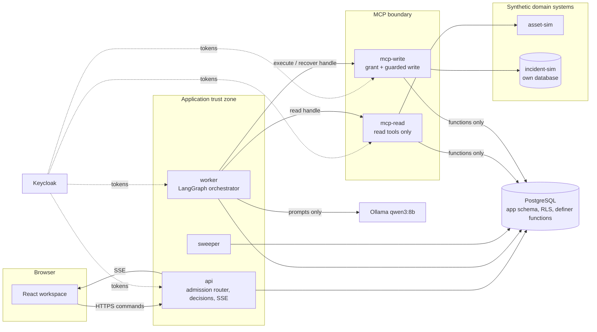
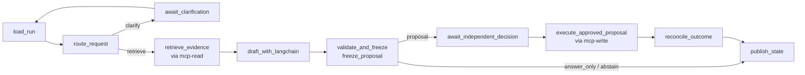

# Architecture: what this project demonstrates

Operations Copilot exists to show four things an interviewer should be able to verify in the code, the tests and the demos: **least privilege**, **routers**, an **orchestrator**, and **MCP servers**. This page is the map. Each section names the components, the requirement IDs whose tests prove the claim (`handoff/acceptance-matrix.json`), and the demo that shows it. The rules themselves live in `SPEC_AMENDMENTS.md` (cited as AM-nn).

> Status: this is the target design. `STATUS.md` says what is built. Nothing below is a claim that the code exists yet.

## The system in one picture

The model (bottom right) has no credential, no database access, no network reach and no tool it can call. It receives evidence and returns text. Everything that can change the world sits on the left and is gated three times: at admission, at independent review, and at the final grant inside the database.

---

## 1. Least privilege

**Claim.** Every principal holds exactly the authority its job needs, enforced by the database, the identity provider and the network, not by application code being careful.

### Principals and what each one holds

| Principal | Credential | Database access | Can reach | Cannot |
|---|---|---|---|---|
| Browser user | Opaque server-side session cookie | none | api only | hold a token, reach MCP or the databases |
| `api` | Keycloak client; DB role `api` | Column-level grants on conversations, messages, runs (`cancel_requested` only), sessions, idempotency, feedback, outbox, jobs (insert) | PostgreSQL, Keycloak admin API (`view-users` only) | update `runs.state`; insert decisions, proposals, grants, attempts or events directly; reach incident-sim |
| `worker` | Keycloak client; DB role `worker` | run_lease, jobs, drafts, checkpoints schema; `runs` columns `checkpoint_id`, `next_event_seq`, `budget_used` | PostgreSQL, mcp-read, mcp-write, Ollama | write decisions, memberships, grants, attempts or events; reach asset-sim or incident-sim |
| `sweeper` | DB role `sweeper` | leases (reclaim), jobs, memberships (sync), outbox, expired sessions | PostgreSQL, Keycloak | decisions, grants, attempts |
| `mcp-read` | Keycloak client; DB role `mcp_read` | **no tables**; `EXECUTE` on `resolve_invocation`, `asset_scope`, `search_procedures_scoped` | PostgreSQL (functions), asset-sim | any write-path function; incident-sim |
| `mcp-write` | Keycloak client; DB role `mcp_exec` | **no tables**; `EXECUTE` on `resolve_invocation`, `grant_execution`, `mark_sent`, `record_outcome`, `request_abort`, `lookup_action` | PostgreSQL (functions), incident-sim | any read function; asset-sim; reading evidence text |
| `operator` CLI | DB role `operator` | `EXECUTE` on `resolve_escalation` only | PostgreSQL | everything else |
| `app_definer` | no login | owns the functions, owns no tables; sees rows only through explicit RLS policies | — | be used by a process |
| Model | **none** | none | none | call a tool, see a credential, assert an outcome |

The full grant table is AM-20.2; the function contracts (callers, inputs, locks, transitions, events) are AM-20.3; the policies are AM-20.5.

### Mechanisms

- **Capability handles.** A worker calls an MCP server with a short-lived, hashed handle bound to one run, one lease fence, one server (read or write) and the token's client ID. The server derives the tool allowlist from the job type, run state and attempt state (AM-15, AM-20.3). The worker cannot choose its own allowlist.
- **Token audiences.** Each MCP server verifies `aud` against its own resource URL and `azp` against the allowed workload clients. A browser token or a worker token presented to incident-sim is rejected (AM-20.7).
- **The final gate is a database function.** `grant_execution` re-checks membership, hash, expiry, cancellation and the asset guard inside one transaction, and only `mcp_exec` may call it. Approval text, model text and chat text never grant anything.
- **Append-only audit.** Decisions, proposals, grants, attempt states, events and operator resolutions are insert-only for every runtime role; "state" is the latest row.
- **Network.** Every published port binds to 127.0.0.1; the model-to-destination and browser-to-internal paths are denied at the Docker network level (R066); Ollama is restricted to loopback and the Docker subnet.

### Proof

| Requirement | What its test shows |
|---|---|
| R084, R124, R128 | `mcp_read`/`mcp_exec` cannot SELECT any table; every role holds exactly its grants; direct writes to audit tables fail |
| R106 | Definer functions are hardened and tenant-isolated by explicit policy text |
| R131 | A read handle presented to mcp-write is rejected; mcp-read cannot execute a write function |
| R026, R027, R085, R100 | Wrong audience, replayed handle, worker-chosen allowlist and cross-run proposal all fail |
| R043, R093, R044 | Self-approval and author-approval denied; approval bound to the exact payload hash |

**Demo 2 (denial):** a cross-tenant or injected attempt is rejected with no write and a clear user state.

---

## 2. Routers

**Claim.** Every path a request can take is enumerable in advance, chosen by deterministic rules first, and no input the router cannot classify ever starts work. Model output may *hint* at a route; it never *selects* one.

There are three routers (AM-16):

| Router | Lives in | Input | Routes | Rule |
|---|---|---|---|---|
| **Admission router** | `api` | an authenticated message | `investigate` (new run), `clarification_reply` (resume), `status_question` (answer from records, no run), `readonly_answer` (read-only run, no proposal), `reject` | Structured fields and `kind` decide; a status question never creates a job; a conflict between text and structured fields becomes a clarification, not a guess |
| **Graph router** | the orchestrator's `route_request` node | run state, resolved context, evidence sufficiency | `clarify`, `retrieve`, `draft`, `answer_only`, `abstain`, `freeze`, `await_decision`, `execute`, `recover` | A route table in `core/`; conditional edges only from that table; the model's classification of intent is one input, never the deciding one |
| **Model router** | `DraftGenerator` factory in the worker | `MODEL_MODE` and policy | `fake` (deterministic, tests), `qwen3:8b` (local), a future larger model | Chosen by configuration, recorded in every run's manifest and `explanation.ready` event; **no silent fallback** between routes |

Why this matters: an "agent" that decides its own next step cannot be audited, budgeted or tested exhaustively. A router with an enumerable table can be: every route has a test, and the set of things the system might do is closed.

### Proof

| Requirement | What its test shows |
|---|---|
| R129 | Every admission and graph route is enumerated; an unroutable or ambiguous input produces a clarification or a 422 and never a job |
| R017, R018 | One active run per conversation; relative intervals resolve once and conflicts clarify |
| R130, R041 | The model route is recorded; a missing model fails clearly instead of falling back |
| R036 | Instructions found in retrieved documents cannot change the route or add a tool |

**Demo 1 (success)** shows the admission router creating one run and the graph router moving it through retrieve → draft → freeze → await decision → execute.

---

## 3. Orchestrator

**Claim.** One explicit LangGraph graph coordinates the investigation. It is durable, resumable after a crash, and never the source of authority.

### The graph

Nodes are deterministic Python; only `draft_with_langchain` calls the model, and only `retrieve_evidence`, `execute_approved_proposal` and `reconcile_outcome` call MCP servers. Edges come from the route table in section 2.

### Properties

- **Evidence before drafting.** The draft node cannot run until `retrieve_evidence` has returned permitted, versioned evidence (R038).
- **Durable pauses.** Clarification and review are `interrupt()`s with a persisted checkpoint; the human's reply arrives as a committed event and a wake-up job, never as trusted resume content (R022, R023, R042).
- **Crash-safe.** Checkpoints are written synchronously; the accepted checkpoint ID is stored on the run under the lease fence; every node is idempotent because LangGraph re-runs a node from its start on resume (AM-12, R108).
- **Not the authority.** Graph state carries IDs and hashes only (R091). The run's state, the approval and the destination receipt live in PostgreSQL and are rechecked by every node. A checkpoint can never approve or execute anything.
- **Not a free agent loop.** There is no "think → pick tool → act" cycle. The spec forbids a raw write loop; the model never sees a tool.

### Proof

| Requirement | What its test shows |
|---|---|
| R038 | A trace shows MCP reads complete before the draft node |
| R042, R108 | Pause/resume survives a worker restart from the stored checkpoint; a stray newer head is ignored |
| R087, R088, R107 | Only the current lease fence can write; a 30 s+ model call keeps the lease; a stale worker's write is rejected |
| R094, R109 | Every grant-to-receipt crash window ends in exactly one truthful outcome |

**Demo 3 (recovery):** `docker kill` the worker between destination commit and acknowledgement; the restarted worker reconciles the original action ID and the destination holds exactly one incident.

---

## 4. MCP servers

**Claim.** Tools cross one standard, authenticated protocol boundary, split into two servers so that the server which can *read* evidence cannot *write* incidents and the server which can write cannot read evidence.

| | `mcp-read` | `mcp-write` |
|---|---|---|
| Tools | `get_asset_status`, `get_recent_alerts`, `search_procedures` | `create_incident`, `get_incident_receipt`, `abort_incident` |
| Handle types accepted | `investigate`, `resume_input` jobs | `execute`, `recover` jobs |
| Token audience | `MCP_READ_RESOURCE_URL` | `MCP_WRITE_RESOURCE_URL` |
| DB role | `mcp_read` (3 functions) | `mcp_exec` (6 functions) |
| Downstream | asset-sim, governed corpus (through functions) | incident-sim |
| Cannot | grant, dispatch, abort, see receipts | search, read asset data, see evidence text |

- Protocol revision 2026-07-28 over Streamable HTTP; per-request protocol version validated (AM-30).
- Tool inputs have JSON schemas; arguments that try to supply a role, tenant, actor or approval are rejected (AM-15).
- Results are typed envelopes; a transport success can still be an application failure, and the caller verifies receipt hashes before recording success.
- The model never calls either server. The orchestrator's deterministic nodes do, with a handle the server resolves to a run, a fence and an allowlist.
- What MCP is **not** here: not the scheduler, not the permission policy, not a place where "approved=true" means anything.

### Proof

| Requirement | What its test shows |
|---|---|
| R025 | An independent process lists and calls tools over the network |
| R026, R027 | Wrong or missing audience, browser token, replayed or expired handle rejected |
| R028, R029, R030 | Read tools enforce current access; unexpected tools fail closed; receipt lookup is restricted to recovery |
| R131 | mcp-read holds no write function and rejects write handles; mcp-write holds no read function and rejects read handles |
| R096 | The destination's action key is atomic, permanent and accepts only mcp-write's identity |

All three demos cross the MCP boundary; demo 2 exercises its denials.

---

## Reading the code

| Directory | What to look at first |
|---|---|
| `core/domain/` | the transition table, route tables, reason enum, canonical JSON |
| `core/db/migrations/` | roles, grants, definer functions, RLS policies (AM-20 in SQL) |
| `api/` | the admission router and the decision endpoint |
| `worker/graph/` | the orchestrator's nodes and edges |
| `mcp-read/`, `mcp-write/` | the two tool servers and their token verifiers |
| `incident-sim/` | the destination's atomic action-key table |
| `tests/acceptance/` | one file per requirement ID |
| `docs/PROJECT_HISTORY.md` | the problems found while designing this, and what changed |
