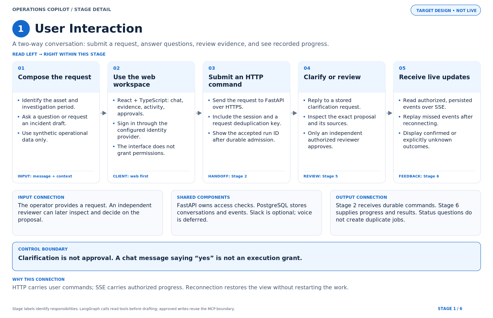
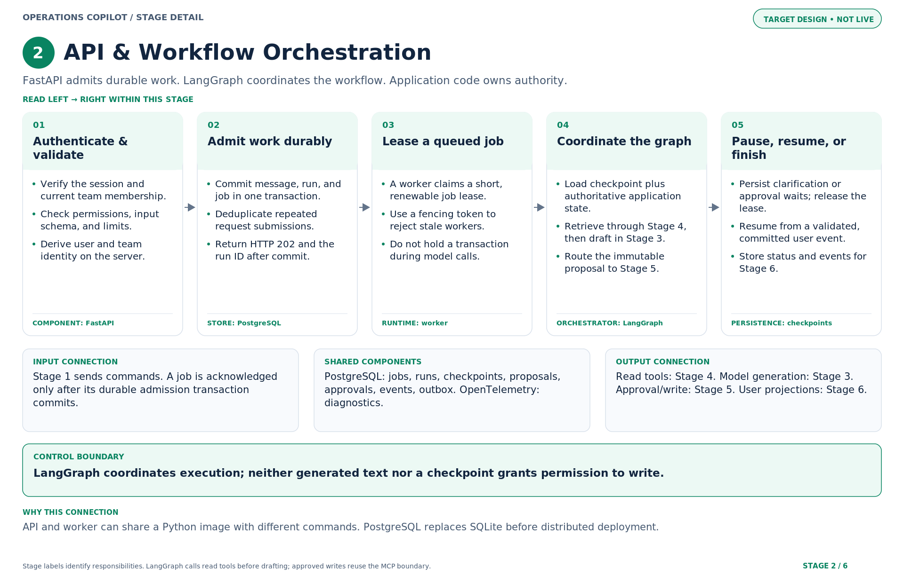
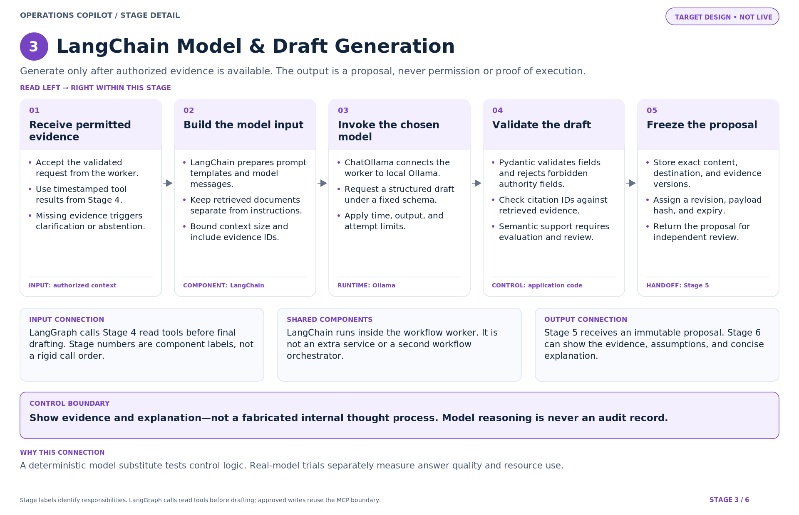
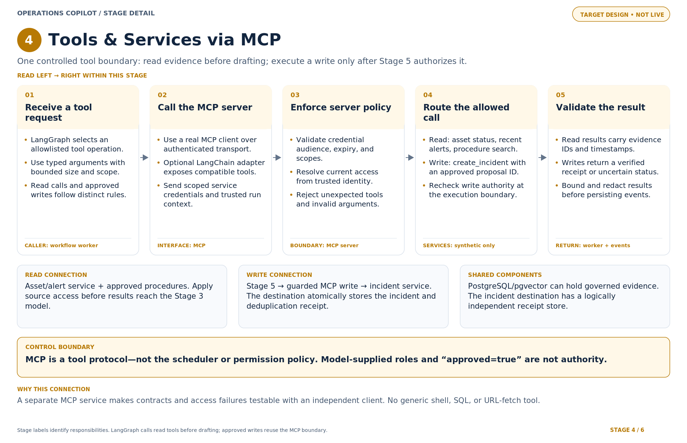
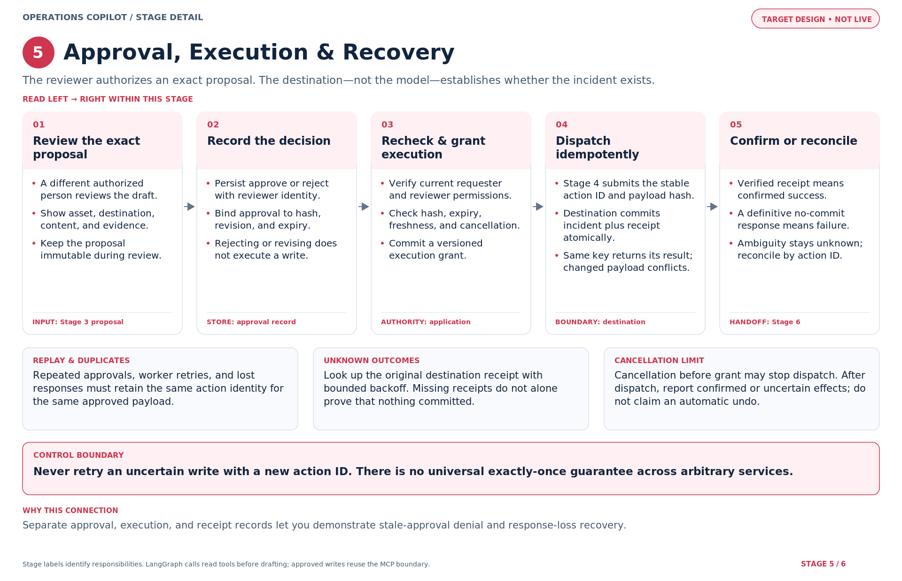
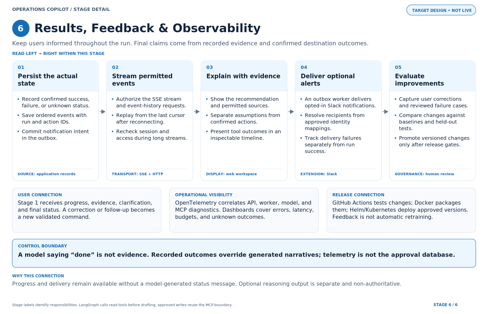

# Operations Copilot — six standalone stage diagrams

**Target design, not a claim of completed integration or production deployment.**

Each image is a separate full-size diagram with its own left-to-right flow. SVG is the scalable version; PNG is a 1920 × 1240 preview. Mermaid contains editable semantic flow, not a pixel-identical rendering.

The stage numbers label component responsibilities rather than a strict execution sequence. LangGraph (Stage 2) calls Stage 4 read tools before Stage 3 final drafting. Stage 5 invokes the MCP write boundary after approval. Stage 6 publishes progress throughout the run.

Source alignment: the existing Operations Copilot implementation guide and the conversation’s clarification of LangChain/LangGraph responsibilities. No implementation or deployment status has changed.

## 1. User Interaction

[SVG](svg/01-user-interaction.svg) · [PNG](png/01-user-interaction.png) · [Mermaid](mermaid/01-user-interaction.mmd)

Clarification is not approval. A chat message saying “yes” is not an execution grant.

## 2. API & Workflow Orchestration

[SVG](svg/02-api-and-orchestration.svg) · [PNG](png/02-api-and-orchestration.png) · [Mermaid](mermaid/02-api-and-orchestration.mmd)

LangGraph coordinates execution; neither generated text nor a checkpoint grants permission to write.

## 3. LangChain Model & Draft Generation

[SVG](svg/03-langchain-model-and-draft.svg) · [PNG](png/03-langchain-model-and-draft.png) · [Mermaid](mermaid/03-langchain-model-and-draft.mmd)

Show evidence and explanation—not a fabricated internal thought process. Model reasoning is never an audit record.

## 4. Tools & Services via MCP

[SVG](svg/04-mcp-tools-and-services.svg) · [PNG](png/04-mcp-tools-and-services.png) · [Mermaid](mermaid/04-mcp-tools-and-services.mmd)

MCP is a tool protocol—not the scheduler or permission policy. Model-supplied roles and “approved=true” are not authority.

## 5. Approval, Execution & Recovery

[SVG](svg/05-approval-execution-and-recovery.svg) · [PNG](png/05-approval-execution-and-recovery.png) · [Mermaid](mermaid/05-approval-execution-and-recovery.mmd)

Never retry an uncertain write with a new action ID. There is no universal exactly-once guarantee across arbitrary services.

## 6. Results, Feedback & Observability

[SVG](svg/06-results-feedback-and-observability.svg) · [PNG](png/06-results-feedback-and-observability.png) · [Mermaid](mermaid/06-results-feedback-and-observability.mmd)

A model saying “done” is not evidence. Recorded outcomes override generated narratives; telemetry is not the approval database.

## Historical diagram-authoring verification

The supplied chart pack reports the following prior checks; this handoff only rechecks SVG XML and file presence, not fresh rendering.

All six SVGs were parsed, all previews rendered with CairoSVG, and text widths/card bounds checked by the generator. Mermaid-engine rendering was not run. This is diagram validation, not application testing.

To regenerate: install Pillow and CairoSVG, then run `python build_charts.py`. The script uses installed DejaVu fonts; no fonts are bundled.
